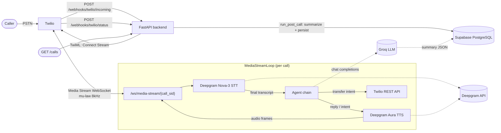

# AI Voice Agent — Backend

**AI Call Interceptor MVP** — a FastAPI backend that receives phone calls via Twilio, holds a real-time voice conversation with the caller (speech-to-text → LLM → text-to-speech), can transfer the call to a human, and persists a full transcript + AI-generated summary of every call.

*Version 0.1.0 · Status: Phases 0–6 implemented (voice loop live-tested) · Spec: `docs/Ai-Voice-MVP.md`*

---

## What the backend does

Someone calls your personal number → your carrier forwards the unanswered call to a Twilio number → Twilio hits this backend → an AI agent answers the phone and talks to the caller.

Concretely, the backend:

| Capability | How |
|---|---|
| **Answers forwarded calls** | Twilio webhook returns TwiML that opens a bidirectional Media Stream WebSocket |
| **Listens to the caller** | Streams μ-law 8 kHz audio to Deepgram Nova-3 STT over WebSocket; final transcripts trigger agent turns |
| **Thinks and replies** | Sends the conversation history to Groq (gpt-oss-120b) with a system prompt defining the assistant persona; detects `[TRANSFER]` / `[END_CALL]` intents in the reply |
| **Speaks back** | Streams the reply text through Deepgram Aura TTS and relays the audio frames to Twilio |
| **Transfers to a human** | On transfer intent, dials `YOUR_PERSONAL_NUMBER` via the Twilio REST API |
| **Ends calls naturally** | On end intent, speaks a farewell then hangs up |
| **Summarises every call** | After hang-up, sends the transcript to the LLM and extracts `{summary, caller_intent, action_items, sentiment}` |
| **Persists everything** | Writes call metadata, transcript and summary to Supabase (PostgreSQL) — idempotent per call |
| **Serves call history** | `GET /calls` and `GET /calls/{call_sid}` endpoints |
| **Secures webhooks** | Every Twilio request is validated with `X-Twilio-Signature` (HMAC) |
| **Stays observable** | Structured JSON logs with `call_sid` context on every key step |

The agent converses in **English, Hindi and Hinglish**, mirroring whichever language the caller uses.


---

## Architecture



<details>
<summary>ASCII version</summary>

```
 Caller ──► Twilio ──► POST /webhooks/twilio/incoming ──► FastAPI
                ◄──── TwiML <Connect><Stream wss://…/> ────┘

 Twilio ◄──Media Stream (WS)──► /ws/media-stream/{call_sid}
                                   │
                     MediaStreamLoop (per call)
                       │
                       ├─► Deepgram STT (live WS) ── final transcript
                       │         │
                       │         ▼
                       │   agent.run_turn(session, text, llm)
                       │         │        │
                       │         │        └─► Groq chat completions
                       │         │
                       │    intent == TRANSFER ──► Twilio REST dial personal number
                       │    intent == END      ──► speak farewell, send stop
                       │    intent == CHAT     ──► Deepgram TTS ──► audio to Twilio
                       │
 Twilio ──► POST /webhooks/twilio/status ──► run_post_call()
                                   │
                     transcript ──► Groq summary ──► Supabase
                                   │
                     calls / call_transcripts / call_summaries

 Dev tools ──► GET /calls , GET /calls/{call_sid}
```
</details>

### Layering & design principles

- **Router → Service/Orchestrator → Repository.** HTTP/WS routes are thin; business logic lives in `MediaStreamLoop` and `run_post_call`; all persistence is behind the `CallsRepository` ABC.
- **Dependency injection everywhere.** STT/TTS/LLM providers, the repository and the LLM are constructor arguments — every layer is unit-testable offline with fakes (81 tests, no network).
- **Pure logic core.** `agent/chain.run_turn`, `agent/intent` and `parse_summary_json` are pure functions.
- **Idempotent writes.** All three tables are unique on `call_sid`; duplicate Twilio status callbacks never double-write.
- **Fail-fast config.** Production boot validates all required secrets at startup.
- **Graceful degradation.** No Supabase keys → in-memory repository; LLM summary failure → fallback summary; bad audio frame → typed error, call continues.

---

## API surface

| Method | Path | Purpose | Auth |
|---|---|---|---|
| `GET` | `/health` | Liveness + config echo (`{"status":"ok","app_env":...}`) | none |
| `POST` | `/webhooks/twilio/incoming` | Call arrives → returns TwiML opening the Media Stream | Twilio signature |
| `POST` | `/webhooks/twilio/status` | Call ended → triggers post-call pipeline (background task) | Twilio signature |
| `WS` | `/ws/media-stream/{call_sid}` | Twilio Media Streams — the live audio conversation loop | (per Twilio spec) |
| `GET` | `/calls?limit=20` | Recent calls, newest first, with transcript + summary embedded | none (MVP) |
| `GET` | `/calls/{call_sid}` | One call with full transcript + summary; 404 if unknown | none (MVP) |


---

## Call lifecycle — how it works

1. **Call arrives.** Twilio POSTs `/webhooks/twilio/incoming`. The signature is verified, then `twiml_builder` returns `<Connect><Stream url="wss://…/ws/media-stream/{CallSid}"/>`.
2. **Stream opens.** The WS endpoint creates/loads a `CallSession` in `SessionStore` and builds a `MediaStreamLoop` wired with Deepgram STT, Aura TTS, Groq LLM and a WS sender.
3. **`start` event.** STT WebSocket connects; a watchdog task starts (60 s inactivity → end call); the greeting is spoken.
4. **`media` events.** Base64 μ-law frames are decoded and forwarded to Deepgram. Final transcripts (500 ms endpointing) trigger agent turns.
5. **Agent turn.** `run_turn` appends to session history, calls Groq with `SYSTEM_PROMPT`, then classifies the reply:
   - `CHAT` → reply is cleaned and spoken through TTS
   - `TRANSFER` → session marked `transferred`, Twilio REST dials your real number
   - `END` → farewell spoken, then a stop frame ends the call
6. **Call ends** (caller hangs up, agent end intent, or watchdog). STT task cancelled, provider closed, session retained briefly.
7. **Post-call.** Twilio's status callback fires `run_post_call` as a background task: transcript assembled → Groq summarises → JSON parsed leniently → `calls`, `call_transcripts`, `call_summaries` rows written → in-memory session removed.

---

## Integrations

| Provider | Used for | Auth | Notes |
|---|---|---|---|
| **Twilio** | Phone number, Media Streams, REST (transfer/hang-up), request signature validation | `TWILIO_ACCOUNT_SID` + `TWILIO_AUTH_TOKEN` | Webhooks must be publicly reachable (ngrok in dev) |
| **Deepgram** | STT: live WebSocket (`nova-3`, multilingual); TTS: streamed `/v1/speak` (`aura-asteria-en`) | `Token <DEEPGRAM_API_KEY>` | Both request `mulaw/8000` (Twilio-compatible) |
| **Groq** | Chat completions for the agent and post-call summaries | `Bearer <GROQ_API_KEY>` | Model `openai/gpt-oss-120b`; retry ×3 with exponential backoff |
| **Supabase (PostgreSQL)** | Persistence: `calls`, `call_transcripts`, `call_summaries` | `SUPABASE_URL` + `SUPABASE_SERVICE_ROLE_KEY` | Service-role key, server-only; schema in `docs/supabase_schema.sql` |

> **Model note:** Groq retired the `llama-3.1` family; this backend uses `openai/gpt-oss-120b`. `openai/gpt-oss-20b` is a faster alternative — change `GROQ_MODEL` in `.env`.

---

## Requirements

- **Python 3.11+** (developed on 3.13)
- A **Twilio** account with a voice-capable phone number (trial works for inbound; upgrade needed to dial/transfer to unverified numbers)
- **Deepgram** API key (free credits are enough for testing)
- **Groq** API key (free tier works)
- **Supabase** project (schema in `docs/supabase_schema.sql`)
- **ngrok** or any public HTTPS tunnel for local development
- Runtime deps: see [`requirements.txt`](requirements.txt) — `fastapi`, `uvicorn[standard]`, `pydantic-settings`, `httpx`, `websockets`, `twilio`, `groq`, `supabase`, `python-multipart`, `python-dotenv`

### Environment variables (`.env` — see `.env.example`)

| Group | Variables |
|---|---|
| App | `APP_ENV`, `APP_PORT`, `LOG_LEVEL`, `SERVER_BASE_URL` (public URL, no trailing slash) |
| Twilio | `TWILIO_ACCOUNT_SID`, `TWILIO_AUTH_TOKEN`, `TWILIO_PHONE_NUMBER`, `YOUR_PERSONAL_NUMBER` |
| Deepgram | `DEEPGRAM_API_KEY`, `DEEPGRAM_STT_MODEL` (nova-3), `DEEPGRAM_TTS_MODEL` (aura-asteria-en) |
| Groq | `GROQ_API_KEY`, `GROQ_MODEL` (openai/gpt-oss-120b) |
| Supabase | `SUPABASE_URL`, `SUPABASE_SERVICE_ROLE_KEY` |
| CORS | `FRONTEND_URL`, `CORS_ORIGINS` |

In `APP_ENV=production` the app refuses to boot if any required secret is missing.

---

## Tools & libraries

| Library | Role |
|---|---|
| **FastAPI** | HTTP + WebSocket framework, OpenAPI/Swagger |
| **uvicorn[standard]** | ASGI server |
| **pydantic / pydantic-settings** | Settings model, production fail-fast validation |
| **websockets** | Deepgram live STT client |
| **httpx** | Async streaming TTS client (+ TestClient transport) |
| **twilio** | TwiML generation, `RequestValidator`, REST calls |
| **groq** | Async chat-completions client |
| **supabase** | PostgREST persistence client |
| **pytest / pytest-asyncio** | Test suite (auto async mode) — 81 tests |
| **Docker** | `Dockerfile` (python:3.11-slim) + `docker-compose.yml` |

---

## Project structure

```
backend/
├── app/
│   ├── main.py                  # FastAPI app factory, routers, exception handlers
│   ├── core/
│   │   ├── config.py            # Settings (env), production fail-fast
│   │   ├── logging.py           # Structured JSON logging (call_sid-aware)
│   │   ├── exceptions.py        # ProviderError, DeepgramError, GroqError, AudioCodecError…
│   │   └── health.py            # GET /health
│   ├── webhooks/router.py       # Twilio webhooks + signature dependency
│   ├── voice/
│   │   ├── router.py            # WS /ws/media-stream/{call_sid}
│   │   ├── media_stream.py      # MediaStreamLoop — the real-time orchestrator
│   │   └── session.py           # CallSession + thread-safe SessionStore
│   ├── agent/
│   │   ├── prompts.py           # System prompt + post-call summary prompt
│   │   ├── intent.py            # Intent enum, [TRANSFER] / [END_CALL] detection
│   │   └── chain.py             # run_turn() — one conversational turn
│   ├── stt/                     # STTProvider ABC + DeepgramSTT (live WS)
│   ├── tts/                     # TTSProvider ABC + DeepgramTTS (streamed)
│   ├── llm/                     # LLMProvider ABC + GroqLLM (retried)
│   ├── telephony/               # TwiML builder + Twilio REST provider
│   └── calls/
│       ├── repository.py        # CallsRepository ABC, InMemory + Supabase impls
│       ├── post_call.py         # run_post_call pipeline + summary JSON parsing
│       └── router.py            # GET /calls, GET /calls/{call_sid}
├── tests/                       # 81 offline tests (fakes, no network)
├── docs/
│   ├── Ai-Voice-MVP.md          # Original product spec
│   ├── Ai-Voice-MVP-Phases.md   # Phased build plan + implementation status
│   └── supabase_schema.sql      # DB migration
├── requirements.txt · Dockerfile · docker-compose.yml · .env.example
```

---

## Feature scope

### Implemented (Phases 0–6 ✅)

- ✅ FastAPI skeleton, `/health`, Swagger, structured JSON logging, Docker scaffolding
- ✅ Twilio webhooks with HMAC signature validation (403 on failure)
- ✅ TwiML Media Stream bootstrap (`<Connect><Stream>`)
- ✅ Deepgram streaming STT (nova-3, multilingual, 500 ms endpointing)
- ✅ Deepgram streaming TTS (aura-asteria-en, μ-law 8 kHz)
- ✅ Groq LLM agent with persona prompt, conversation history, retry/backoff
- ✅ Intent detection — natural conversation, human transfer, natural end
- ✅ Real-time Media Stream loop: greeting, per-turn serialisation, watchdog (60 s inactivity), clean shutdown
- ✅ Post-call pipeline: transcript assembly → LLM summary (`summary` / `caller_intent` / `action_items` / `sentiment`) → persistence
- ✅ Supabase persistence (idempotent) + in-memory fallback for dev
- ✅ `GET /calls`, `GET /calls/{call_sid}`
- ✅ 81 offline unit/integration tests; live-tested end-to-end with a real phone call

### Known limitations (by design, for MVP)

- **No authentication** on `GET /calls*` (spec: auth arrives in V1)
- **TTS is English-optimised** (`aura-asteria-en`); Hindi/Hinglish replies sound accented — multilingual TTS is a V1 candidate
- **No barge-in/interruption** — the agent can't be interrupted mid-sentence
- **Transfer requires a paid Twilio account** (trial can't dial unverified numbers)
- **Sessions are process-local** — single-worker deployment assumed

### Not in scope (V1 candidates)

Authentication, dashboard/frontend, barge-in, call-recording storage, multi-tenant support, voice cloning, analytics.

---

## Running it

```powershell
# 1. Install
py -3.11 -m venv .venv
.\.venv\Scripts\pip install -r requirements.txt

# 2. Configure
copy .env.example .env      # then fill in every value (see Requirements)

# 3. Database (once) — run docs/supabase_schema.sql in the Supabase SQL editor

# 4. Expose locally
ngrok http 8000             # put the forwarding URL in SERVER_BASE_URL

# 5. Point Twilio at you (Console → number → Voice):
#    "A call comes in" → https://<ngrok>/webhooks/twilio/incoming  (POST)
#    "A call ends"     → https://<ngrok>/webhooks/twilio/status    (POST)

# 6. Run
.\.venv\Scripts\python.exe -m uvicorn app.main:app --host 0.0.0.0 --port 8000

# 7. Call your Twilio number
```

Docker alternative: `docker compose up --build`

---

## Testing

```powershell
.\.venv\Scripts\python.exe -m pytest -q        # 81 passed (offline, no API keys needed)
```

Test map: `test_intent` · `test_chain` · `test_session` · `test_prompts` · `test_media_stream` · `test_stt` · `test_tts` · `test_llm` · `test_twiml` · `test_webhooks` · `test_repository` · `test_post_call` · `test_calls_api` · `test_config` · `test_health`

For the manual real-call test procedure (ngrok + Twilio console + voice scenarios), see `docs/Ai-Voice-MVP-Phases.md` → *Implementation status*.

---

*MVP v0.1.0 · Stack: FastAPI + Twilio + Deepgram + Groq + Supabase*

